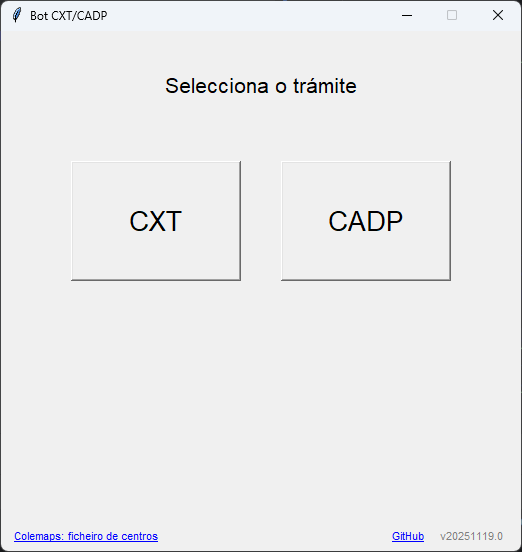
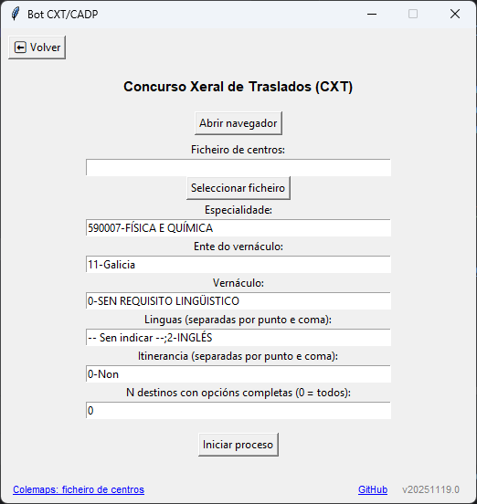
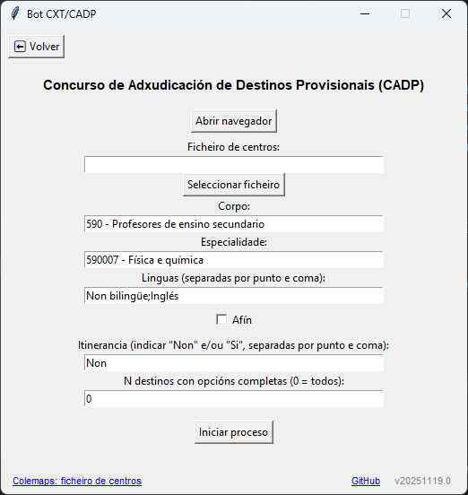
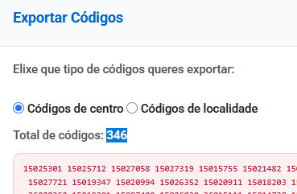

# BotCXT/CADP
Bot desenvolvido en Python para automatizar o envío de solicitudes na páxina da Xunta de Galicia do Concurso Xeral de Traslados (CXT) e no Concurso de Adxudicación de Destinos Provisionais (CADP) utilizando Selenium e unha interface gráfica baseada en Tkinter.

Pódese ver un titorial de uso da primeira versión do bot (así como a explicación de por que se difunde esta ferramenta) no enlace: https://youtu.be/pKWsqMe5GYo

Pódese ver un titorial de uso para o CXT 2025 de Pablo Rodríguez Vila no enlace: https://youtu.be/_to3aAMq-8M


Máis información en: https://profesoradogalicia.com/botcxt/


## ☕ Apoia o proxecto
Se queres agradecer o traballo, podes convidarme a un café:

<a href="https://www.buymeacoffee.com/manuelduro" target="_blank"></a>

https://buymeacoffee.com/manuelduro


## GUI





---


## Contidos

1. [Requisitos](#requisitos)  
2. [Instalación](#instalación)  
3. [Uso](#uso)
4. [Límite de destinos](#límite-de-destinos) 
5. [Estrutura do proxecto](#estrutura-do-proxecto) 
6. [Compilación do executable](#compilación-do-executable)  
7. [Notas e boas prácticas](#notas-e-boas-prácticas)  

---

## Requisitos
Para simplemente lanzar o executable dist/botcxt.exe (usar o programa como tal) necesitamos:
- Navegador Mozilla Firefox
- O ficheiro co listado dos centros ordenados por tempo/distancia. Pódese obter en https://profesoradogalicia.com/colemaps/

Se ademais queremos executar o código fonte ou compilalo necesitamos tamén:
- Python 3.12 (recomendado)  
- Pip
- Librerías de Python especificadas no requirements.txt
 

## Instalación
Instalar o navegador Mozilla Firefox https://www.mozilla.org/es-ES/firefox/new/

Clonar o repositorio ou descargalo nun zip.

### Instalación simple

Para usar o executable sen instalar nada adicional, executar dist/botcxt.exe (con doble click é suficiente).

Se salta un aviso de Windows ou do antivirus pódese ignorar e proceder coa execución (esto é debido a que non o recoñece como un programa habitual xa que non é dunha grande corporación ou organización).

### Instalación avanzada

Para executar o código fonte directamente, instalar as dependencias:
  ```bash
  pip install -r requirements.txt
  ```
E despois executar:
  ```bash
  python src/botcxt.py
  ```

## Uso
1. Executar o ficheiro dist/botcxt.exe (doble click nel) ou executar directamente o código.
2. Na interface gráfica:
- Ao abrir o programa, seleccionar o trámite: CXT ou CADP.
- Cada formulario dispón dun botón ⬅ Volver para regresar á pantalla de selección.
- Premer Abrir navegador para iniciar Firefox. Iniciar a sesión e ir ao apartado de "Peticións" do CXT.
- Seleccionar un ficheiro de centros (.txt) que conte os códigos dos centros, separados por espacios ou saltos de liña. Este ficheiro pódese obter en https://centroseducativos.gal/
- No CXT configurar:
  - Especialidade
  - Ente do vernáculo
  - Vernáculo
  - Linguas → separadas por ; (exemplo: -- Sen indicar --;2-INGLÉS)
  - Itinerancia → separada por ; (exemplo: 0-Non;1-Si)
  - N destinos con opcións completas → número de centros aos que se lles aplicarán todas as linguas. Os restantes só recibirán a primeira lingua indicada.
3. Premer Iniciar proceso para introducir as solicitudes automaticamente.

O programa mostrará unha mensaxe cando o proceso remate ou se produza un erro.

## Límite de destinos
O formulario da Xunta só admite 400 peticións no CXT e 1000 no CADP (polo menos para especialidades de secundaria en Galicia). Se se empregan varias linguas ou itinerancias, o número de combinacións por centro pode duplicarse ou triplicarse, podendo superar este límite.

Para evitar superar o límite, engadiuse o campo:
```bash
N destinos con opcións completas
```
### Funcionamento

Os N primeiros centros do ficheiro faranse con todas as linguas e itinerancias indicadas.

O resto dos centros non se duplicarán: faranse só coa primeira lingua e itinerancia escrita. Por exemplo, en "-- Sen indicar --;2-INGLÉS", quedarase só coa opción "-- Sen indicar --".

Se non se vai facer uso do parámetro, pode deixarse o valor 0.

### Exemplo práctico
Ao exportar os códigos ordenados en Colemaps, veremos o número total de centros:



Neste exemplo, son 346. Dependendo do trámite teremos un límite de 400 (no CXT) ou de 1000 (no CADP). Para explicalo usaremos o CXT.

Supoñamos que quero poder optar a plazas bilingües en inglés. Teño que facer as peticións por duplicado (unha sen bilingüismo e outra en inglés). Como teño 346 centros, se poño un 0 no parámetro N o bot tratará de poñer 692 peticións, polo que superaremos o límite e a web da Xunta queixarase.

Por tanto, para tratar de maximizar as opcións, nas primeiras peticións faremos que vaian por duplicado (non bilingüe e inglés) co parámetro N. Pódese plantexar así:
```bash
(límite - centros) / (repeticións - 1) = N
```

Que neste caso sería:
```bash
(400 - 346) / (2 - 1) = 54
```
É dicir, que podería duplicar (opción non bilingüe e opción bilingüe) nos 54 primeiros centros. Por tanto, no parámetro N indicaría un 54.

Se se quere facer o mesmo tendo en conta máis linguas ou incluindo tamén a itinerancia, hai que ter en conta a explosión combinatoria.

Se seleccionáramos non bilingüe, inglés, non itinerante e itinerante, por cada centro teremos 4 peticións e, por tanto:
```bash
(400 - 346) / (4 - 1) = 18
```

Neste caso, teriamos que poñer o valor 18 no parámetro N para que os 18 primeiros centros vaian por cuadriplicado e o resto centros ata a petición número 400 vaian coa primeira opción escollida de idioma e itinerancia. 

## Estrutura do proxecto
```bash
BotCXT-CADP
│
├─ botcxt.py                       # Punto de entrada da aplicación, monta a UI principal
├─ src/
│   ├─ controllers/
│   │   ├─ base_controller.py      # Controlador base con funcionalidades comúns
│   │   ├─ cxt_controller.py       # Controlador específico de CXT
│   │   ├─ cadp_controller.py      # Controlador específico de CADP
│   │   └─ navigation.py           # Controlador principal de navegación entre pantallas
│   │
│   ├─ models/
│   │   ├─ scraper.py              # Funcións de Selenium para automatización web
│   │   └─ logger.py               # Funcións para rexistrar os logs
│   │
│   └─ views/
│       ├─ pantallas_seleccion.py  # Pantalla inicial
│       ├─ form_cxt.py             # Vista do formulario CXT
│       └─ form_cadp.py            # Vista do formulario CADP
│
├─ README.md                       # Documentación
├─ dist/                           # Executable xerado por PyInstaller
└─ requirements.txt                # Librarías usadas no proxecto

```

## Compilación do executable
Para a compilación dun executable de Windows cun só ficheiro, executar no terminal:
```bash
pyinstaller --noconsole --onefile --paths src src/botcxt.py
```
Creará unha carpeta dist na que estará o executable botcxt.exe.
Neste repositorio facilítase a última versión do executable lista para lanzar.

## Notas e boas prácticas
- Asegurarse de que Mozilla Firefox está actualizado.
- Revisar que os nomes nos formularios da web coincidan exactamente (incluindo maiúsculas/minúsculas ou espacios) coas seleccións do código.
- Para cambiar os valores por defecto no GUI, modificar manualmente os distintos parámetros.
- O bot foi deseñado para uso persoal e responsable, polo que se insta a non facer spam de solicitudes á páxina da Xunta.
- O bot recolle de forma automática información mínima de uso, incluíndo a versión do bot, nome do trámite executado (CXT ou CADP), número de centros (non se garda que centros se piden nin a orde), especialidade, linguas, itinerancias e estado final do proceso (exitoso ou erro). Esta información úsase únicamente para control de uso, detección de erros e poder implementar melloras sen recoller ningún dato persoal nin datos sensibles dos usuarios. Pódese consultar o ficheiro src/models/logger.py (así coma os controladores que invocan ás súas funcións) para comprobar de primeira man os datos que se están tratando.
- O código é aberto e totalmente auditable. Ninguén debe confiar cegamente en executables sen revisalos.