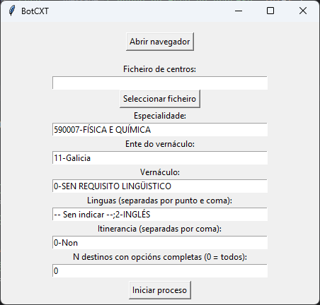

# BotCXT
Bot desenvolvido en Python para automatizar o envío de solicitudes na páxina da Xunta de Galicia do Concurso Xeral de Traslados (CXT) utilizando Selenium e unha interface gráfica baseada en Tkinter.



---

## Contidos

1. [Requisitos](#requisitos)  
2. [Instalación](#instalación)  
3. [Uso](#uso)
4. [Límite de destinos](#límite-de-destinos) 
5. [Estrutura do proxecto](#estrutura-do-proxecto) 
6. [Funcionamento](#funcionamento)  
7. [Creación do executable](#creación-do-executable)  
8. [Notas e boas prácticas](#notas-e-boas-prácticas)  

---

## Requisitos

- Navegador Mozilla Firefox
- Python 3.12 (recomendado)  
- Pip
- Librerías de Python especificadas no requirements.txt.
- O ficheiro co listado dos centros ordenados por tempo/distancia. Pódese obter en https://centroseducativos.gal/ (hai un tutorial dispoñible na propia web). 

## Instalación
Instalar o navegador Mozilla Firefox https://www.mozilla.org/es-ES/firefox/new/

Clonar o repositorio ou descargar un zip.

Para usar o executable sen instalar nada adicional, executar dist/botcxt.exe.

Para executar o código fonte instalar as dependencias:
  ```bash
  pip install -r requirements.txt
  ```

Ou manualmente:
  ```bash
  selenium==4.22.0
  pyinstaller==6.16.0
  webdriver-manager==4.0.1
  ```

## Uso
1. Executar o script:
  ```bash
  python src/botcxt.py
  ```
2. Na interface gráfica:
- Premer Abrir navegador para iniciar Firefox. Iniciar a sesión e ir ao apartado de "Peticións" do CXT.
- Seleccionar un ficheiro de centros (.txt) que conte os códigos dos centros, separados por saltos de liña. Este ficheiro pódese obter en https://centroseducativos.gal/
- Configurar:
  - Especialidade
  - Ente do vernáculo
  - Vernáculo
  - Linguas → separadas por ; (exemplo: -- Sen indicar --;2-INGLÉS)
  - Itinerancia → separada por , (exemplo: 0-Non,1-Si)
  - N destinos con opcións completas → número de centros aos que se lles aplicarán todas as linguas. Os restantes só recibirán a primeira lingua indicada.
3. Premer Iniciar proceso para introducir as solicitudes automaticamente.

O programa mostrará unha mensaxe cando o proceso remate ou se produza un erro.

## Límite de destinos
O formulario da Xunta só admite 400 peticións (polo menos para especialidades de secundaria en Galicia). Se se empregan varias linguas ou itinerancias, o número de combinacións por centro pode duplicarse ou triplicarse, superando con creces este límite.

Para evitar superar o límite, engadiuse o campo:
```bash
N destinos con opcións completas
```
Funcionamento:

Os N primeiros centros do ficheiro faranse con todas as linguas e itinerancias indicadas.

O resto dos centros non se duplicarán: faranse só coa primeira lingua e itinerancia escrita. Por exemplo, en "-- Sen indicar --;2-INGLÉS", quedarase só coa opción "-- Sen indicar --".

Se non se vai facer uso do parámetro, pode deixarse o valor 0.

## Estrutura do proxecto
```bash
Bot-CXT/
│
├─ src/
│   ├─ app.py       # Interface gráfica e control principal
│   └─ scraper.py   # Funcións de Selenium para automatización web
├─ dist/            # Executábeis xerados por PyInstaller. Aquí atópase o exe listo para usar
├─ build/           # Carpeta temporal de compilación de PyInstaller
├─ requirements.txt # Librarías usadas no proxecto 
└─ README.md        # Documentación
```


## Funcionamento

app.py
- Xestiona a interface de usuario con Tkinter.
- Permite seleccionar ficheiros e iniciar o navegador.
- Lanza a función lanzar do módulo scraper.py.

scraper.py
- Contén a función lanzar que automatiza a interacción coa páxina web.
- Para cada centro, itinerancia e lingua, selecciona os valores correspondentes nos formularios e realiza o envío.

Selenium + Firefox:
- O bot usa webdriver.Firefox() para abrir e controlar o navegador.

## Creación do executable
Para crear un executable de Windows cun só ficheiro executar no terminal:
```bash
pyinstaller --noconsole --onefile src/botcxt.py
```
Creará unha carpeta dist na que estará o executable botcxt.exe.
Neste repositorio facilítase a última versión do executable lista para lanzar.

## Notas e boas prácticas
- Asegurarse de que Mozilla Firefox está actualizado.
- Revisar que os nomes nos formularios da web coincidan coas seleccións do código (select_by_visible_text).
- Para cambiar os valores por defecto no GUI, modificar manualmente os distintos parámetros.
- O bot foi deseñado para uso persoal e responsable; polo que se insta a non facer spam de solicitudes á páxina da Xunta.